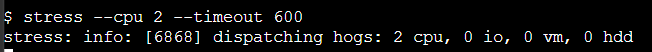

# W9 Observability - Terraform Setup

### Bài 2: CPU Alarm → Email Alert via SNS

#### 2.1 SNS Topic Created


#### 2.2 SNS Email Subscription Confirmed


#### 2.3 CloudWatch Alarm - Configuration


#### 2.4 CloudWatch Alarm - In ALARM State

Chạy `stress` trên EC2 để trigger alarm, sau đó kiểm tra status của CloudWatch Agent:

```bash
stress --cpu 2 --timeout 600
```




#### 2.5 Email Notification Received


---

### Bài 3: Installing CloudWatch Agent on EC2

#### 3.1 Verify CloudWatch Agent Installed 

```bash
sudo systemctl status amazon-cloudwatch-agent
```


#### 3.2 CloudWatch Agent Config

```bash
cat > /opt/aws/amazon-cloudwatch-agent/etc/amazon-cloudwatch-agent.json << 'EOF'
{
  "agent": {
    "metrics_collection_interval": 60,
    "run_as_user": "root"
  },
  "metrics": {
    "namespace": "CWAgent",
    "metrics_collected": {
      "cpu": {
        "resources": ["*"],
        "measurement": [
          "cpu_usage_idle",
          "cpu_usage_user",
          "cpu_usage_system"
        ],
        "totalcpu": true,
        "metrics_collection_interval": 60
      },
      "mem": {
        "measurement": [
          "mem_used_percent",
          "mem_total",
          "mem_used"
        ],
        "metrics_collection_interval": 60
      },
      "disk": {
        "resources": ["/"],
        "measurement": [
          "disk_used_percent"
        ],
        "metrics_collection_interval": 60
      }
    }
  }
}
EOF
```

#### 3.4 CloudWatch Metrics - CWAgent Namespace

