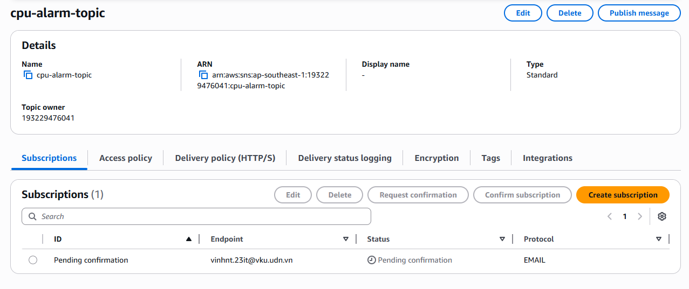
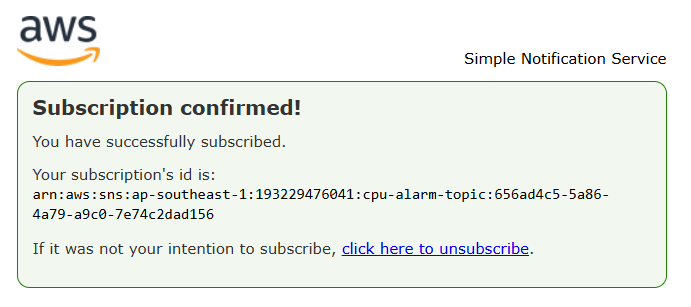
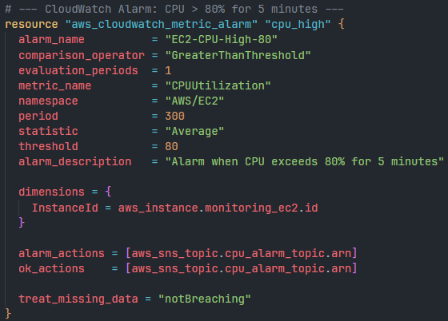
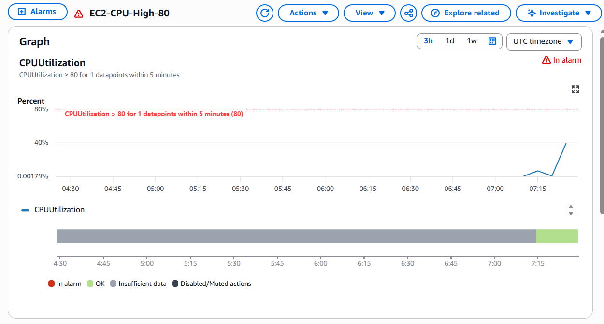
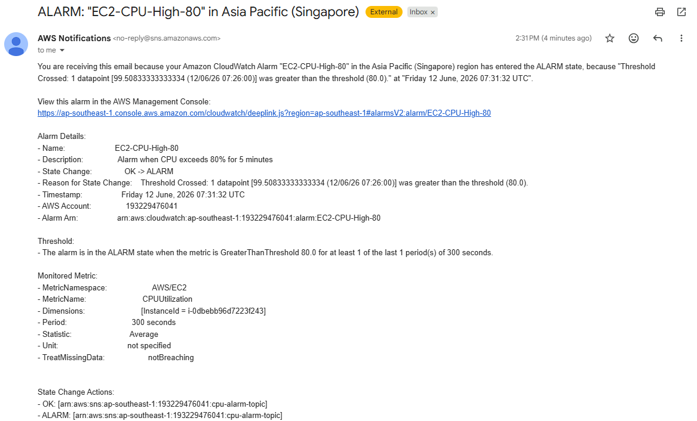
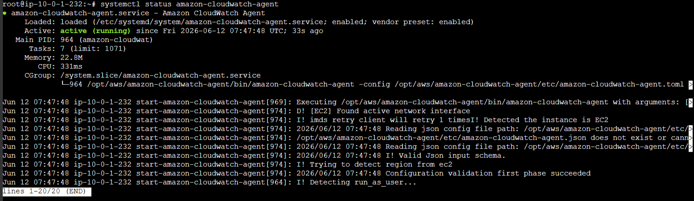
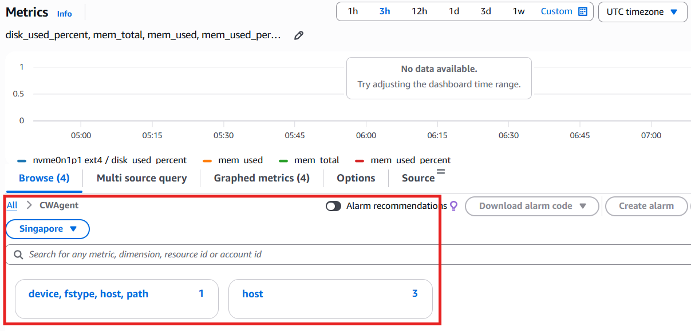

# W9 Observability - Terraform Setup

## Quick Start

### 1. Cấu hình

```bash
cd terraform
cp terraform.tfvars.example terraform.tfvars
```

Sửa `terraform.tfvars`:
```hcl
alert_email   = "your-real-email@gmail.com"
aws_region    = "ap-southeast-1"
instance_type = "t2.micro"
key_name      = "your-key-pair"  # để "" nếu không cần SSH
```

### 2. Deploy

```bash
terraform init
terraform plan
terraform apply
```

> ⚠️ Sau khi apply, check email để **confirm SNS subscription**.

### 3. Verify CloudWatch Agent

SSH vào EC2 (hoặc dùng SSM Session Manager):

```bash
sudo /opt/aws/amazon-cloudwatch-agent/bin/amazon-cloudwatch-agent-ctl -m ec2 -a status
```

### 4. Trigger CPU Alarm (Stress Test)

```bash
stress --cpu 2 --timeout 600
```

Sau ~5 phút, CloudWatch Alarm chuyển sang state `ALARM` → email notification gửi qua SNS.

### 5. Cleanup

```bash
terraform destroy
```

---

## Evidence Screenshots

### Bài 2: CPU Alarm → Email Alert via SNS

#### 2.1 SNS Topic Created


#### 2.2 SNS Email Subscription Confirmed


#### 2.3 CloudWatch Alarm - Configuration


#### 2.4 CloudWatch Alarm - In ALARM State


#### 2.5 Email Notification Received


---

### Bài 3: Installing CloudWatch Agent on EC2

#### 3.1 CloudWatch Agent Installed


#### 3.2 CloudWatch Agent Config


#### 3.3 CloudWatch Agent Running (Status)


#### 3.4 CloudWatch Metrics - CWAgent Namespace


---

## Cấu trúc

```
├── terraform/
│   ├── main.tf
│   ├── variables.tf
│   ├── outputs.tf
│   ├── userdata.sh
│   └── terraform.tfvars.example
├── evidence/             ← screenshots go here
│   ├── sns-topic.png
│   ├── sns-subscription-confirmed.png
│   ├── cloudwatch-alarm-config.png
│   ├── cloudwatch-alarm-triggered.png
│   ├── email-notification.png
│   ├── cw-agent-installed.png
│   ├── cw-agent-config.png
│   ├── cw-agent-status.png
│   └── cw-agent-metrics.png
└── README.md
```
